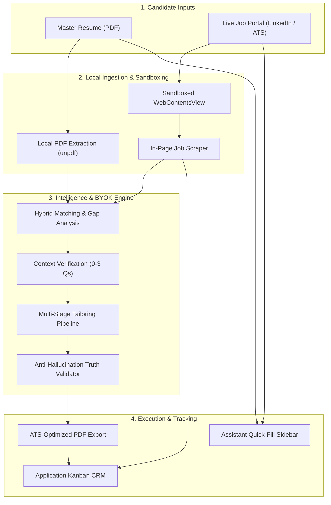

<p align="center">
  
</p>

<h1 align="center">CareerFlow</h1>

<p align="center">
  <strong>The local-first AI copilot for intelligent job matching, ATS resume tailoring, and real-time application tracking.</strong>
</p>

<p align="center">
  <a href="#-downloads--desktop-installers"></a>
  <a href="#-downloads--desktop-installers"></a>
  <a href="#-downloads--desktop-installers"></a>
  <a href="#-product-walkthrough--demo"></a>
</p>

<p align="center">
  <a href="https://www.electronjs.org/"></a>
  <a href="https://react.dev/"></a>
  <a href="https://www.typescriptlang.org/"></a>
  <a href="https://tailwindcss.com/"></a>
  <a href="https://supabase.com/"></a>
  <a href="https://platform.openai.com/"></a>
</p>

---

## 📥 Downloads & Desktop Installers

Pre-packaged installers are generated directly via CI/CD for Windows, macOS, and Linux:

| Operating System | Package | Direct Download Link | Architecture |
| :--- | :--- | :--- | :--- |
| **Windows** | Setup Installer (`.exe`) | [**📥 Download CareerFlow-Setup.exe**](https://github.com/Abhraroy/CareerFlow/releases/latest/download/career-flow-1.0.2-setup.exe) | x64 |
| **macOS (Apple Silicon)** | Disk Image (`.dmg`) | [**📥 Download CareerFlow-arm64.dmg**](https://github.com/Abhraroy/CareerFlow/releases/latest/download/career-flow-1.0.2-arm64.dmg) | Apple Silicon (M1 / M2 / M3 / M4) |
| **macOS (Intel)** | Disk Image (`.dmg`) | [**📥 Download CareerFlow-x64.dmg**](https://github.com/Abhraroy/CareerFlow/releases/latest/download/career-flow-1.0.2-x64.dmg) | Intel 64-bit |
| **Linux** | Universal Binary | [**📥 Download CareerFlow.AppImage**](https://github.com/Abhraroy/CareerFlow/releases/latest/download/career-flow-1.0.2.AppImage) | x64 |
| **Linux (Debian/Ubuntu)** | Package (`.deb`) | [**📥 Download CareerFlow.deb**](https://github.com/Abhraroy/CareerFlow/releases/latest/download/career-flow-1.0.2.deb) | x64 |

> 📌 *All binaries and checksums are published on the [CareerFlow GitHub Releases page](https://github.com/Abhraroy/CareerFlow/releases).*

---

<!-- ## 📺 Product Walkthrough & Demo

<!-- ================================================================= -->
<!-- DEMO VIDEO LINK PLACEHOLDER                                       -->
<!-- Replace the YouTube/Loom URL and thumbnail below when ready:     -->
<!-- ================================================================= -->
<!-- 
[](https://www.youtube.com/watch?v=YOUR_VIDEO_ID_HERE "Click to watch CareerFlow demo walkthrough") -->

<!-- > 📹 **Walkthrough Video:** [**Watch the Full Product Tour on YouTube (Link)**](https://www.youtube.com/watch?v=YOUR_VIDEO_ID_HERE)  
> *(Paste your YouTube, Loom, or MP4 link here)* -->

<!-- --- --> -->

## ✨ Why This Exists

Job hunting in today's market is structurally exhausting:

* **Tab Chaos & Mental Overhead:** Candidates juggle 20+ browser tabs across LinkedIn, Greenhouse, and Lever while cross-referencing master resumes and disconnected spreadsheets.
* **The ATS Black Box:** Applicants blindly submit generic resumes into Applicant Tracking Systems (ATS), never knowing which keywords or qualification gaps triggered an automated rejection.
* **Tedious Manual Tailoring:** Meaningful tailoring takes 30–45 minutes per role. As a result, candidates either burn out or spray unoptimized applications that get ignored.
* **Repetitive Form Typing:** Every job portal asks for the exact same contact details, work history, education dates, and EEO answers over and over again.
* **Exorbitant AI SaaS Subscriptions:** Most career tools charge $30–$50/month for superficial AI wrappers with hard usage caps and opaque data policies.

**CareerFlow fixes this.** It places an embedded, sandboxed job portal browser right beside an intelligent assistant sidebar, automated resume rewriter, and pipeline CRM. You keep full control over your data, pay raw OpenAI API rates (typically pennies per month), and never switch tabs again.

---

## 🚀 What It Does

| Capability | What It Does | Why It Matters |
| :--- | :--- | :--- |
| **Live Portal Browser Slot** | Runs live job portals inside a native, sandboxed `WebContentsView` with session persistence. | Zero tab-switching. Browse and apply on LinkedIn while your profile and AI copilot stay docked right next to the page. |
| **Job Radar & Match Analytics** | Evaluates job postings against your resume to calculate 0–100% **Fit** and **Potential** scores. | Spend time only on high-yield opportunities where your experience genuinely matches requirements. |
| **Diagnostic Gap Analysis** | Extracts job requirements and categorizes them into `MATCH`, `PARTIAL`, and `GAP` with actionable fix recommendations. | Demystifies why an ATS might reject your resume and tells you exactly what keywords or skills to emphasize. |
| **Multi-Stage Resume Tailor** | Rewrites summary, skills, experience, and project bullets to target specific job requirements without inventing facts. | Generates tailored, ATS-ready resumes in under 60 seconds with line-by-line diff inspections. |
| **Interactive Context Gathering** | Asks 0–3 targeted questions when requirements are missing or ambiguous to gather real candidate context. | Eliminates hallucinations. The AI tailors based on your actual verified experience rather than fabricated claims. |
| **1-Click Quick-Fill Sidebar** | Exposes formatted personal info, work history bullets, education, and portfolio links with instant copy buttons. | Cuts manual form filling from 15 minutes to 2 minutes per application. |
| **Targeted Recruiter Outreach** | Generates tailored outreach templates for tech recruiters, hiring managers, and peer connections. | Turn cold applications into direct conversations with decision-makers in seconds. |
| **Interactive Kanban CRM** | Tracks application statuses (`Applied`, `Shortlisted`, `Interviewing`, `Offer`, `Rejected`) with notes and linked resume versions. | Replaces fragile spreadsheets with a purpose-built candidate pipeline. |
| **BYOK Transparency Hub** | Encrypts your OpenAI API key using your OS keychain and displays real-time token counts and cost estimates. | Total data privacy and zero subscription markup—pay raw OpenAI API costs of cents per month. |

---

## 🔥 Key Features

### 🖥️ Native Embedded Job Portal Browser
* **Isolated Session Partitions:** Independent sessions (`persist:${portalId}`) preserve login state for job boards without sharing tracking cookies across portals.
* **Safety Wrapper Resolver:** Automatically unwraps nested redirect wrappers (such as LinkedIn's `/safety/go/?url=...`) to navigate directly to actual employer ATS destination pages (Greenhouse, Lever, Workday).
* **Automatic Apply Detection:** An active watcher script detects when you click **"Apply"**, **"Easy Apply"**, or **"Submit Application"**, prompting you to log the submission into your pipeline instantly.
* **One-Click DOM Extraction:** Scrapes structured job postings (title, company, logo, role description) directly from the active view into the local database.

### 🎯 Deep Match Analytics & ATS Diagnostic View
* **Semantic & Exact Overlap:** Compares candidate experience against role requirements using OpenAI embeddings (`text-embedding-3-small`) and structured criteria analysis.
* **Itemized Requirement Audit:** Classifies every extracted qualification into `MATCH`, `PARTIAL`, or `GAP`.
* **Actionable Advice:** Highlights missing technical keywords and provides concrete phrasing adjustments to improve your ATS match score before applying.

### ✍️ Intelligent Multi-Stage Tailoring Engine
Unlike naive prompts that rewrite entire documents blindly, CareerFlow uses a modular 7-stage tailoring pipeline:

1. **Context Questions:** Analyzes gaps and prompts you with 0–3 short questions to verify real background experience.
2. **Priority Classification:** Groups job requirements into High, Medium, and Low priority for the target role.
3. **Local Evidence Mapping:** Correlates existing resume entries with requirements locally with zero LLM token consumption.
4. **Strategy Formulation:** Decides section-by-section actions (`REWRITE`, `EMPHASIZE`, `CONDENSE`, or `KEEP`).
5. **Segmented Rewriting:** Rewrites summary, skills, experience bullets, and project descriptions individually against strict anti-hallucination rules.
6. **Truth Validator:** Compares new text against original claims to ensure no metrics, technologies, or titles were fabricated.
7. **ATS Score Estimation:** Computes post-tailor keyword coverage and quality indicators.

### 📄 Resume Workspace & Visual Canvas
* **Lossless Local Parsing:** Uses `unpdf` directly inside the Electron main process to extract raw text and convert it into a structured, typed `ResumeDocument` without sending files to third-party parsing APIs.
* **Canvas Document Preview:** Zoomable, pixel-perfect A4 document canvas rendering your structured profile with clean typography.
* **Line-by-Line Change Inspector:** Inspect visual diffs showing exactly which words, phrases, and bullet points were modified.
* **Native PDF Export:** Generates clean, ATS-compliant PDF resumes via `jsPDF` or native Electron `webContents.printToPDF`.

### 📋 Application Assistant & Quick-Fill
* **Searchable Profile Drawer:** Filter personal details, work history, degree dates, GPA, and project links with immediate 1-click clipboard copy.
* **Cold Outreach Generator:** Pre-populated networking messages customized with the target role and company name for recruiters, hiring managers, and team members.

### 📊 Transparent BYOK & Token Economics
* **OS-Level Key Encryption:** Raw OpenAI API keys are encrypted immediately with Electron's `safeStorage` (Windows DPAPI, macOS Keychain, Linux Secret Service). The decrypted key is never exposed to the renderer UI.
* **Token Analytics:** Real-time tracking of input tokens, output tokens, and total token usage broken down by feature (`RESUME_TAILOR`, `JOB_ANALYZE`, `RESUME_MATCH`, `COVER_LETTER`) and time window (Today, 7 Days, 30 Days, All Time).

---

## 🧠 How It Works



---

## 🎯 Use Cases

* **High-Volume Targeted Applications:** Apply to dozens of engineering or product roles weekly with tailored resumes for each job description instead of generic submissions.
* **ATS Screen Optimization:** Discover missing keywords, tools, or domain terminology before submitting an application.
* **Career Transitions & Pivots:** Use the interactive question flow to surface transferable skills and contextual achievements from previous roles that directly address new job requirements.
* **Zero-Context-Switch Job Hunting:** Browse LinkedIn or company career pages, view match analytics, copy standard form answers, and track submissions all inside a single desktop window.

---

## 🛠️ Tech Stack

### Desktop & Core Runtime
* **[Electron 39](https://www.electronjs.org/)** – Native desktop runtime with multi-process architecture.
* **[electron-vite 5](https://electron-vite.org/)** & **[Vite 7](https://vitejs.dev/)** – Lightning-fast build tooling and HMR for main, preload, and renderer layers.
* **[electron-builder 26](https://www.electron.build/)** – Multi-platform installer packaging (NSIS, DMG, AppImage, Deb).

### Frontend & State Management
* **[React 19](https://react.dev/)** & **[TypeScript 5.9](https://www.typescriptlang.org/)** – Strongly-typed modern component architecture.
* **[Tailwind CSS v4](https://tailwindcss.com/)** – High-performance styling with full dark mode support.
* **[Zustand 5](https://github.com/pmndrs/zustand)** – Global state orchestration across route navigation, tailoring pipelines, and application caches.
* **[React Icons](https://react-icons.github.io/react-icons/)** – Crisp Lucide icon set.

### Document & Canvas Processing
* **[Konva 10](https://konvajs.org/)** & **[react-konva 19](https://github.com/konvajs/react-konva)** – Zoomable 2D canvas rendering for interactive resume previewing.
* **[jsPDF 4](https://github.com/parallax/jsPDF)** – Dynamic, ATS-formatted A4 PDF document generation.
* **[unpdf 1.8](https://github.com/unjs/unpdf)** – Local, zero-cloud PDF text extraction in the main process.

### AI, Intelligence & Validation
* **[OpenAI API](https://platform.openai.com/)** – Chat completions (`gpt-4o-mini`) and vector embeddings (`text-embedding-3-small`).
* **[Vercel AI SDK](https://sdk.vercel.ai/)** (`ai`, `@ai-sdk/openai`) – Structured LLM inference.
* **[Zod 4](https://zod.dev/)** – Strict schema validation for parsed resumes, tailoring diffs, and analysis reports.

### Database, Cache & Security
* **[Supabase](https://supabase.com/)** – PostgreSQL database, pgvector extension, authentication, and Row-Level Security (RLS).
* **[Upstash Redis](https://upstash.com/)** – Real-time progress tracking and status synchronization across processes.
* **Electron `safeStorage`** – Native OS-level credential encryption (DPAPI, Keychain, Libsecret).

---

## 📦 Installation

### Prerequisites
* **Node.js**: `v22.0.0` or higher
* **Package Manager**: `npm` (or `bun`)
* **Git**: Installed and configured on your machine

### 1. Clone the Repository
```bash
git clone https://github.com/Abhraroy/CareerFlow.git
cd CareerFlow
```

### 2. Install Dependencies
```bash
npm install
```
*(Or if using Bun: `bun install --frozen-lockfile`)*

### 3. Configure Environment Variables
Create a `.env` file in the root directory:
```bash
cp .env.example .env
```
Populate your Supabase credentials and optional Upstash Redis endpoints (see [Configuration](#️-configuration)).

### 4. Set Up the Database
Run the schema files in your Supabase SQL editor:
1. `schema.sql` (Core tables: users, resumes, jobs, applications, scores, ai_usages)
2. `schema_patch.sql` (pgvector support, job requirements, candidate facts, and resume evidence)
3. `schema_byok.sql` (BYOK token usage tracking tables)

### 5. Launch in Development Mode
```bash
npm run dev
```

---

## ⚙️ Configuration

Configure your environment variables in `.env`:

```env
# Supabase Configuration (Required for Auth & Data Storage)
VITE_SUPABASE_URL=https://your-project.supabase.co
VITE_SUPABASE_ANON_KEY=your-anon-key

# Upstash Redis (Optional - for real-time progress events in main process)
UPSTASH_REDIS_REST_URL=https://your-redis-instance.upstash.io
UPSTASH_REDIS_REST_TOKEN=your-redis-token

# Logging & Debug Mode
IS_DEV=false
VITE_IS_DEV=false
```

> [!NOTE]
> **OpenAI API Key Setup:** You do **not** put your OpenAI API key in `.env`. Once the application launches, navigate to **Settings → API Usage** to enter your OpenAI API key. It is validated live and encrypted securely in your native OS keychain.

---

## ▶️ Usage

### 1. Add Your Master Resume
1. Go to the **Resumes** tab.
2. Click **Upload Resume** and select your PDF resume.
3. The local engine extracts your experience, education, projects, and skills into a structured profile without uploading files to external parsers.

### 2. Browse Jobs on Live Portals
1. Select **LinkedIn** (or custom portal) in the sidebar.
2. Search for roles directly inside the embedded browser.
3. Navigate to any job posting—CareerFlow automatically extracts the job title, company, description, and company logo.

### 3. Analyze Job Fit
1. Open the **Job Assistant Sidebar** docked next to the browser.
2. Click **Analyze Match** to run the diagnostic engine.
3. Review your **Fit Score**, **Potential Score**, strengths, and specific keyword gaps.

### 4. Tailor Your Resume
1. Click **Tailor Resume**.
2. Answer 0–3 short context verification questions if gaps are identified.
3. Inspect the live before-and-after diffs in the **Change Impact Inspector**.
4. Download the tailored resume as an ATS-ready PDF.

### 5. Quick-Fill Applications & Outreach
1. Switch to the **Quick Fill** tab in the assistant sidebar while on an application page.
2. Use 1-click copy buttons for your contact details, work bullets, and portfolio links.
3. Click **Outreach** to generate a personalized recruiter message or hiring manager note.

### 6. Track Your Pipeline
1. Click **Applications** in the navigation bar.
2. View your active applications in Kanban view (`Applied`, `Interviewing`, `Offer`, etc.).
3. Record interview dates, salary estimates, recruiter contacts, and notes.

---

## 🏗️ Architecture

CareerFlow is engineered with strict separation of concerns across Electron's process boundaries:

```
┌────────────────────────────────────────────────────────────────────────┐
│                        MAIN PROCESS (Node.js)                          │
│                                                                        │
│  ┌───────────────────────┐  ┌───────────────────────────────────────┐  │
│  │  PortalNavManager     │  │  Security & Cryptography              │  │
│  │  - WebContentsViews   │  │  - safeStorage (OS Keychain/DPAPI)    │  │
│  │  - Sandboxed sessions │  │  - Decrypt key in memory per call     │  │
│  │  - URL un-wrapper     │  │  - Direct OpenAI API execution        │  │
│  └───────────────────────┘  └───────────────────────────────────────┘  │
│  ┌───────────────────────┐  ┌───────────────────────────────────────┐  │
│  │  Local PDF Parsing    │  │  Upstash Redis & Storage Bridge       │  │
│  │  - unpdf byte engine  │  │  - Local file caching                 │  │
│  │  - Zero cloud parsing │  │  - IPC Event Dispatchers              │  │
│  └───────────────────────┘  └───────────────────────────────────────┘  │
└───────────────────────────────────┬────────────────────────────────────┘
                                    │ IPC (Preload Bridge / contextIsolation)
┌───────────────────────────────────▼────────────────────────────────────┐
│                       RENDERER PROCESS (Chromium)                      │
│                                                                        │
│  ┌──────────────────────────────────────────────────────────────────┐  │
│  │  Central Navigation Router (Zustand: useNavigationStore)         │  │
│  └──────────────┬───────────────────────────────────┬───────────────┘  │
│                 ▼                                   ▼                  │
│  ┌──────────────────────────────┐   ┌───────────────────────────────┐  │
│  │  App Views                   │   │  Job Assistant Sidebar        │  │
│  │  - Dashboard & Metrics       │   │  - 1-Click Form Quick-Fill    │  │
│  │  - Match Table & Detail      │   │  - Match Score Semicircle     │  │
│  │  - Resume Workspace (Canvas) │   │  - Outreach Message Generator │  │
│  │  - Tailoring Studio (Diffs)  │   │  - Persistent Candidate Facts │  │
│  │  - Applications Kanban CRM   │   │                               │  │
│  │  - BYOK Usage & Token Stats  │   │                               │  │
│  └──────────────────────────────┘   └───────────────────────────────┘  │
└────────────────────────────────────────────────────────────────────────┘
```

---

## 📁 Project Structure

```text
CareerFlow/
├── .github/workflows/       # Multi-platform CI/CD release pipeline
├── build/                   # Application icons & native packaging metadata
├── docs/                    # Feature specifications & navigation architecture
├── resources/               # Runtime icons and prompt templates
├── src/
│   ├── main/                # Electron Main Process
│   │   ├── index.ts         # IPC handlers, safeStorage encryption, window lifecycle
│   │   └── portal/          # WebContentsView manager, URL resolver & safety wrappers
│   ├── preload/             # Secure contextBridge API bindings
│   ├── scrapperEngine/      # In-page DOM scrapers for job boards
│   ├── utils/               # Node utilities: logger, file operations, Redis
│   └── renderer/            # React 19 Frontend
│       └── src/
│           ├── app/         # Root App component and layout
│           ├── components/
│           │   ├── applications/   # Applications Kanban & Table CRM
│           │   ├── dashboard/      # Executive metrics overview
│           │   ├── jobassistantsidebar/ # Quick-fill, outreach & score gauge
│           │   ├── jobs/           # Match radar, requirements & gap analysis
│           │   ├── resumes/        # Resume document canvas & library
│           │   ├── sidebar/        # Primary navigation & user profile
│           │   ├── tailorResume/   # Tailoring studio, question cards & diffs
│           │   └── ApiUsagePage.tsx# BYOK token tracker & key manager
│           ├── navigation/         # Central typed navigation store
│           ├── supabase_utils/     # Database client queries & mutations
│           └── utils/              # Tailoring engine, PDF generation & parser
├── electron-builder.yml     # Packaging configuration for Win, Mac, Linux
├── electron.vite.config.ts  # Vite build configuration for multi-process Electron
├── package.json             # Scripts & dependencies
├── schema.sql               # Base database schema
├── schema_patch.sql         # pgvector & candidate facts migration
└── schema_byok.sql          # BYOK token tracking migration
```

---

## 🔐 Security / Privacy

* **Hardware/OS-Backed Encryption:** Your OpenAI API key is encrypted using Electron's `safeStorage`, which leverages Windows DPAPI, macOS Keychain, or Linux Secret Service (`libsecret`). It is never stored in plain text.
* **Main Process Isolation:** Decryption occurs strictly inside the Electron main process for the single API call. The decrypted key is never exposed across the IPC context bridge to the renderer window.
* **Context Isolation & Sandboxing:** All renderer views run with `contextIsolation: true`, `sandbox: true`, and `nodeIntegration: false`.
* **Zero Third-Party PDF Parsing:** Resumes are parsed locally in-memory via `unpdf`. Your documents are not transmitted to third-party document parsing clouds.
* **Session Sandboxing:** Embedded job portal browser sessions run in partitioned web views (`persist:${portalId}`), preventing job boards from accessing local app storage.

---

## ⚡ Performance / Scalability

* **Local Evidence Matching (0 LLM Tokens):** The evidence retrieval phase runs locally on structured resume sections, saving LLM tokens and accelerating tailoring.
* **Canvas-Accelerated Rendering:** The resume viewer leverages Konva 2D canvas rendering to enable smooth zooming and panning of A4 documents without DOM reflow penalties.
* **State-Driven Navigation:** Decoupled Zustand router avoids unnecessary DOM teardowns and preserves embedded `WebContentsView` states across route switches.
* **Scalable BYOK Architecture:** Because inference calls use the candidate's own API key directly against OpenAI, the platform incurs no centralized server GPU costs and scales to unlimited users with zero API infrastructure overhead.

---

## 🧪 Development

### Available Scripts

| Command | Purpose |
| :--- | :--- |
| `npm run dev` | Starts the electron-vite development server with hot-reload. |
| `npm run build` | Runs typechecks and compiles main, preload, and renderer bundles. |
| `npm run test` | Runs unit tests (including `PortalUrlResolver.test.ts`). |
| `npm run typecheck` | Validates TypeScript types across node and web targets. |
| `npm run lint` | Lints the codebase with ESLint. |
| `npm run format` | Formats code with Prettier. |
| `npm run build:unpack` | Builds production output into an unpacked local directory. |
| `npm run build:win` | Packages Windows executable installer (`.exe`). |
| `npm run build:mac` | Packages macOS application (`.dmg`). |
| `npm run build:linux` | Packages Linux binaries (`.AppImage` and `.deb`). |

### Running Tests
Unit tests use Node.js's built-in test runner:
```bash
npm run test
```

---

## 🤝 Contributing

Contributions are welcome! Please follow these steps:

1. **Fork the Repository** on GitHub.
2. **Create a Feature Branch**:
   ```bash
   git checkout -b feature/amazing-feature
   ```
3. **Commit Your Changes**:
   ```bash
   git commit -m "feat: add amazing feature"
   ```
4. **Ensure Checks Pass**:
   ```bash
   npm run typecheck
   npm run test
   npm run lint
   ```
5. **Push to Your Branch**:
   ```bash
   git push origin feature/amazing-feature
   ```
6. **Open a Pull Request**.

---

## 📄 License

This project is created and maintained by [Abhradip Roy](https://github.com/Abhraroy). Distributed under the MIT License. See `LICENSE` for details.

---

## ⭐ Start Streamlining Your Job Search

CareerFlow turns chaotic, soul-draining job hunts into an organized, data-driven, and automated workflow.

* **Browse Jobs** without tab overload
* **Tailor Resumes** without hallucinations
* **Autofill Applications** without manual retyping
* **Track Opportunities** from first match to final offer

[Download Windows .exe](https://github.com/Abhraroy/CareerFlow/releases/latest/download/career-flow-1.0.0-setup.exe) · [View All Releases](https://github.com/Abhraroy/CareerFlow/releases) · [Report an Issue](https://github.com/Abhraroy/CareerFlow/issues) · [Submit a Feature Request](https://github.com/Abhraroy/CareerFlow/issues)
